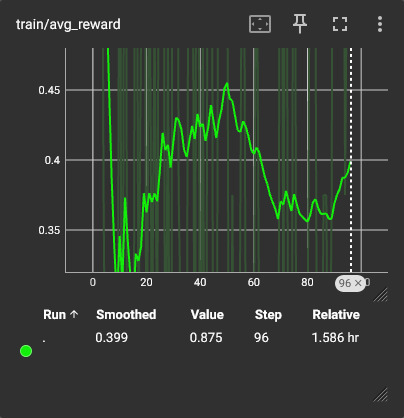
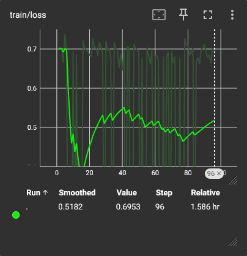

# grpo-zero-training
Implement GRPO Zero training on the MATH dataset.

### Results

Our from-scratch GRPO implementation achieves relatively stable training, though it could benefit from more fine-tuning. As shown in the curves below, we observe a steadily decreasing preference loss and a noisy but positive trend in the average reward (plotted with smoothing for interpretability purposes). Further training on the full dataset and continued hyperparameter tuning can maximize performance and stabilize training.

Our baseline Phi-3-mini fine-tuned on the MATH dataset achieves an accuracy of **37%**. Our GRPO model, trained on an additional 120 samples from the MATH dataset (train/val:100/20) achieves an accuracy of **~42%**. While minimal, this indicates a non-zero improvement from our baseline. Given our extremely small training set and minimal iterations, this is enough to meaningfully conclude that our GRPO implementation does improve from the baseline.

#### Curve Analysis

The training curve indicates a clear downward trend, showing a moderately decreasing loss as the model continuous to learn. Contrastingly, the average reward has displays a phase of rapid learning followed by a dip in bperformance from steps ~50-80. While both loss and reward signals are noisy, this is (relatively) expected in RL training. However, we observe a promising recovery towards the end of the run confirming that the model's continued learning.





#### Further fine-tuning

Training is stable (no exploding gradients), but learning has stalled. The model can likely benefit from:

1. An increased `temperature` (0.4 -> 0.7)
2. An increased `num_generations` per training batch - however we face hardware constraints here (OOM)
3. Further experimentation with `learning_rate` and `beta` (strength of preference loss)

### Execution Pipeline

First, build and run your environment. This environment is fully containerized using Docker.

```
make build
make run
```

We first perform supervised fine-tuning to align with section 2 of the DeepSeekMath paper (section 2).
Since we cannot decontaminate/collect a large-scale corpus, we simply fine-tune on the MATH dataset (NIPS21).

To run supervised fine-tuning, simply run the following
(LLM backbone is set to Phi-3-mini by default).:

```
make train-sft
```

To train with GRPO policy, use the following make command:

```
make train-grpo
```

We follow the procedure below:
1. Generate a group of unique solutions for the problem
2. Each solution is given a binary reward (1 if the final answer is correct, 0 otherwise).
3. The single correct response is labeled the "winner." We perform pairwise comparison between the winner and every other solution to increase the probability gap between log-probability(winner) and log-probability(loser), bypassing the trained reward model.
4. The policy is optimized to increase the probability of the winner over all losers, training the model to prefer the correct reasoning path.

### Evaluation

Finally, to perform evaluation of the trained model, simply run the following:

```
make evaluate
```